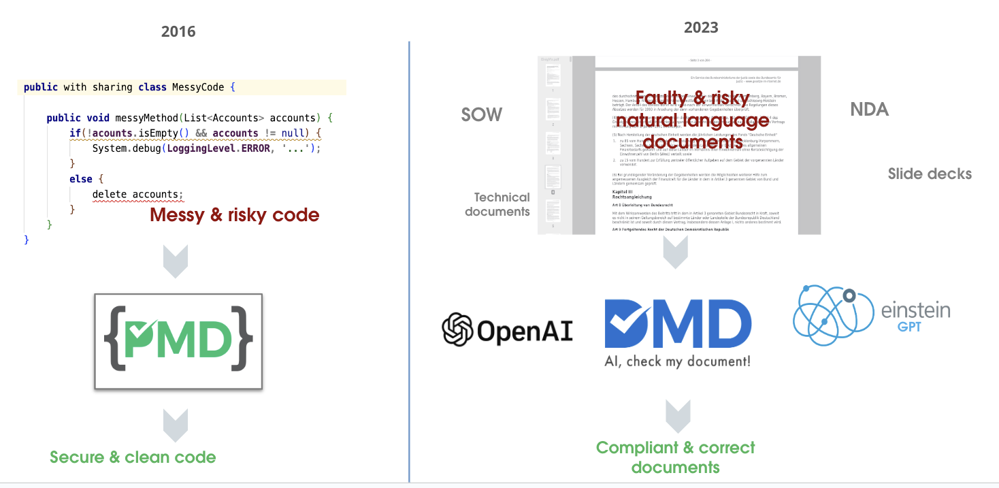
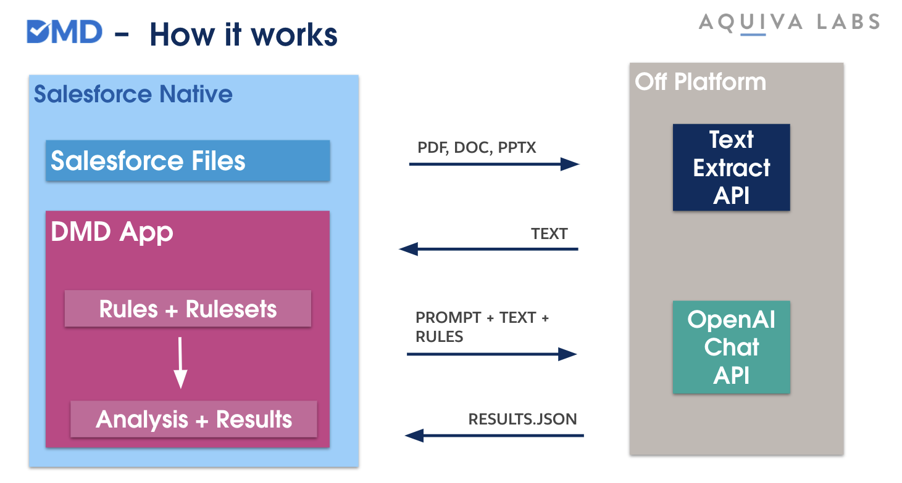

##  DMD (Document Mess Detector)

... is a native Salesforce app that uses Generative AI to check whether business documents in Files and Attachments comply with a set of rules.

- [Install v1.7 as Unlocked Package (Production)](https://login.salesforce.com/packaging/installPackage.apexp?p0=04tVI000000HvujYAC)

- [Install v1.7 as Unlocked Package (Sandbox)](https://test.salesforce.com/packaging/installPackage.apexp?p0=04tVI000000HvujYAC)

### Highlight

- Write Rules in simple Natural language and group them in Rulesets.
- Run Analysis on Salesforce Files or Attachments
- Analysis Results will be justified by document quotes.
- Monitor the Accuracy of the AI using scheduled Regression Tests.
- Native Salesforce App with Custom Objects for Rules, Rulesets, Analyses etc.
- Uses Freemium Extractor API to extract text from documents (use your own API key)
- Uses Prompt Builder and Template for customizing the instrctions and model
- Leverages the Salesforce Trust Layer
- Export & Import of Rulesets
- Comfortable Setup UI for Post-Install Steps

### Demo Video

### How it works

DMD lends its name from [PMD the famous and widely used Static Code Analyser](https://pmd.github.io/). While PMD improves the quality of code by checking its compliance against rulesets that define antipatterns and smells, DMD checks the quality of business documents like contracts, specifications and written agreements.

Understanding code for PMD is easy as code can understand code. Writing PMD rules was hard because humans had to learn how to write their rules in the language of the "machine".

DMD is very different and uses Large Language Models (LLMs) like OpenAI, Deepseek, Claude or Gemini. LLMs with their capabilities to understand and reason natural language text are just perfect to rule description and prompts in natural language.

DMD is a technology proof-of-concept by the Salesforce Product Development Partner Aquiva Labs. It was built to showcase the use of Generative AI within a native Salesforce Managed Package, even before Salesforce released its native, trusted LLM features.

The App is also available as a [free app on the AppExchange](https://appexchange.salesforce.com/appxListingDetail?listingId=8ae56cbd-8b6b-4009-bf17-1781d9416fe8). The AppExchange version is outdated and does not reflect this repos code.

### How do I use 

 Please check the detailed [User Guide (PDF)](user-guide.pdf).

### How it works 

### How do I extend 

1. Clone the repo
1. Spin up a scratch org using `scripts/create-scratch-org.sh`
1. Understand the [Solution design](solution-design.md) to understand the architecture and components of the app
1. Adjust and Extend the app as you like

---

> __DISCLAIMER - Simple vs. sophisticated__
> 
> Despite this App being a free AppExchange app, which has passed Security Review it was never written with a long commercial career in mind. So we cut corners in a few > places to keep the projects short and focused. So if you see some ugly parts here 
> and there, let us know but be kind to us. This project is mainly about sharing 
> results and excitement in "AI for Salesforce".
> 
> We also made some adjustments, and simplifications to the original code to better 
> fit the Open Source purpose. To have less loose metadata parts, we:
> 
> - Skipped moving UI text to Custom Labels
> - Merged classes to have the most related code in one place