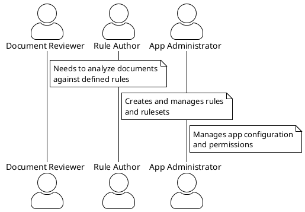
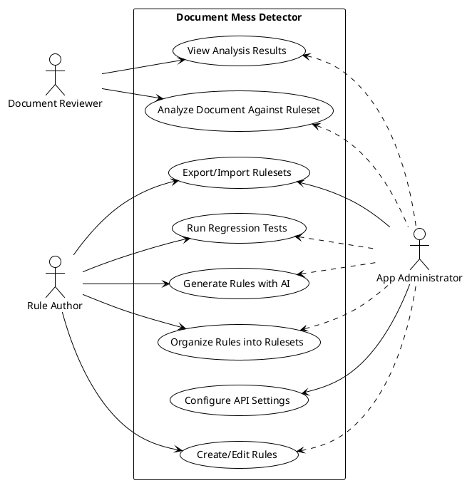
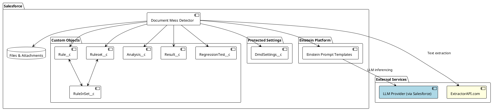
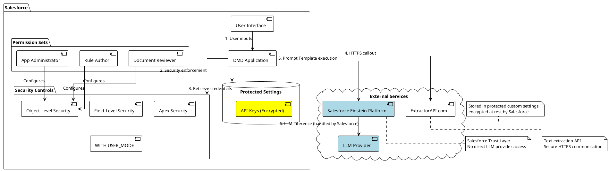
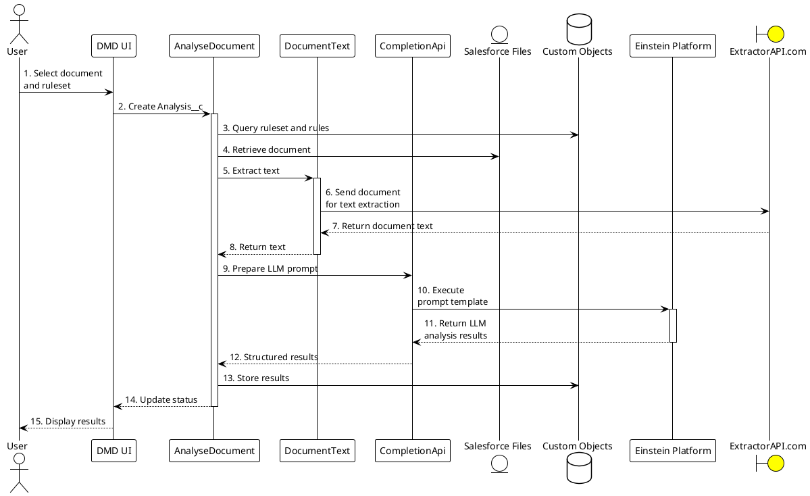
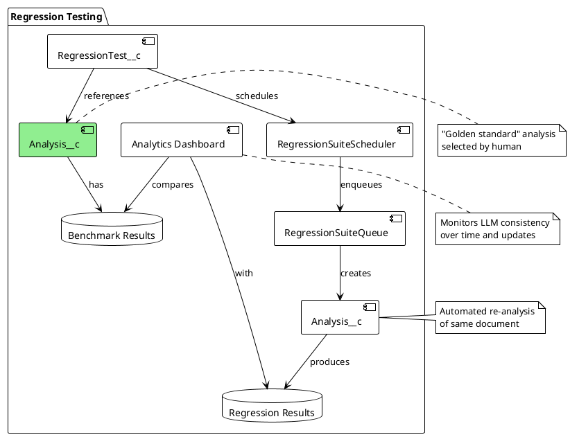

# Document Mess Detector (DMD) - Solution Design

## Overview

Document Mess Detector (DMD) is a native Salesforce application that uses Generative AI to analyze business documents in Salesforce Files and Attachments, checking them against configurable rulesets. The application helps ensure document quality and compliance with organizational standards by leveraging Large Language Models (LLMs) through Salesforce's Einstein Prompt Templates system.

This document outlines the solution design for DMD, with a focus on security aspects relevant for Salesforce Security Review.

## Personas

### Document Reviewer
- **Responsibilities**: Selects and analyzes documents against predefined rulesets
- **Permissions**: Can create analyses but cannot modify rules or rulesets
- **Primary tasks**: 
  - Select documents for analysis
  - View analysis results
  - Share results with colleagues

### Rule Author
- **Responsibilities**: Creates and maintains rules and rulesets
- **Permissions**: Can create/modify rules and rulesets, and run regression tests
- **Primary tasks**:
  - Create rules in natural language
  - Organize rules into rulesets
  - Generate rules with AI assistance
  - Run regression tests to ensure AI analysis consistency

### App Administrator
- **Responsibilities**: Configures and maintains the application
- **Permissions**: Full access to all app functionality, including setup functions
- **Primary tasks**: 
  - Configure external API settings
  - Manage user permissions
  - Monitor application usage
  - Export/Import rulesets

## Use Cases

### 1. Analyze Document Against Ruleset
A Document Reviewer selects a document (PDF, text file) from Salesforce Files or Attachments and chooses a ruleset to analyze it against. The application extracts text from the document, processes it through an AI model against the rules, and returns results.

### 2. View Analysis Results
Users view analysis results showing whether each rule passed or failed, with justifications quoting relevant document sections.

### 3. Create/Edit Rules
Rule Authors create rules using natural language to describe requirements for documents, without needing special syntax or ML expertise.

### 4. Organize Rules into Rulesets
Rule Authors group related rules into rulesets, with optional context to help the AI understand the document type and purpose.

### 5. Generate Rules with AI
Rule Authors can request AI to generate relevant rules based on ruleset context.

### 6. Run Regression Tests
Rule Authors set up regression tests to ensure consistency in AI evaluations over time by using a benchmark document and comparing results.

### 7. Configure API Settings
Administrators configure necessary API credentials for document text extraction and maintain app settings.

### 8. Export/Import Rulesets
Administrators and Rule Authors can export rulesets for backup or transfer, and import them into other orgs.

## System Architecture

### Key Components

1. **Custom Objects**:
   - `Rule__c`: Stores individual rules defined in natural language
   - `Ruleset__c`: Groups related rules with optional context information
   - `RuleInSet__c`: Junction object connecting rules to rulesets
   - `Analysis__c`: Represents a document analysis against a ruleset
   - `Result__c`: Stores individual rule results within an analysis
   - `RegressionTest__c`: Configuration for regression testing

2. **Protected Custom Settings**:
   - `DmdSettings__c`: Organization-wide settings, including API keys

3. **External Integrations**:
   - **ExtractorAPI.com**: 3rd party service for document text extraction
   - **Salesforce Einstein Platform**: For secure access to LLM models

## Security Architecture

### Security Aspects

#### 1. Authentication and Authorization

- **Permission Sets**:
  - Three distinct permission sets define access levels:
    - `DocumentReviewer`: Limited to analyzing documents and viewing results
    - `RuleAuthor`: Can create/modify rules and rulesets, run regression tests
    - `AppAdministrator`: Full access including setup functionality
  - All implement proper object and field-level security restrictions

- **Object and Field-Level Security**:
  - Custom objects are secured through permission sets with proper CRUD and FLS settings
  - Apex code uses `WITH USER_MODE` to enforce object and field-level security

#### 2. Credential Storage

- **API Key Management**:
  - ExtractorAPI key stored in protected custom settings (`DmdSettings__c`)
  - Protected custom settings are encrypted at rest by Salesforce
  - Only accessible through Apex, not directly through UI or reports
  - `SetupExtractApi` class handles secure storage and retrieval

- **LLM Access**:
  - No direct LLM API keys stored in the application
  - All LLM access through Salesforce's Einstein Platform (Prompt Templates)
  - Salesforce handles authentication to LLM providers

#### 3. Data Protection

- **Document Processing**:
  - Documents remain within Salesforce ecosystem
  - Only document text (not binary content) is sent to external services
  - Text extraction via secure HTTPS calls to ExtractorAPI.com
  - All network communication uses TLS

- **Sensitive Information**:
  - Application doesn't permanently store document text, only analysis results
  - Results may contain short quotes from documents for justification
  - API keys are never exposed in UI or logs

#### 4. External Service Integration

- **ExtractorAPI.com**:
  - Remote site setting configured to allow HTTPS callouts
  - Secure document text extraction with API key authentication
  - Properly handles document size limitations to prevent heap issues

- **Einstein Prompt Templates**:
  - Leverages Salesforce's trusted infrastructure for LLM access
  - Prompt templates defined within Salesforce, not externally
  - Uses Salesforce's secure channel to LLM providers

## Data Flow

### Security Considerations in Data Flow

1. **Document Selection (Steps 1-2)**:
   - User can only see documents they have access to (Salesforce standard security)
   - Permission to create Analysis__c records is controlled by permission sets

2. **Data Access (Steps 3-4)**:
   - Queries use `WITH USER_MODE` to enforce object-level security
   - Document access leverages Salesforce's standard file security model

3. **Text Extraction (Steps 5-8)**:
   - API key retrieved from protected custom settings
   - Secure HTTPS callout to ExtractorAPI.com
   - Document size checks prevent heap overflow attacks

4. **LLM Processing (Steps 9-12)**:
   - No direct API keys exposed
   - Leverages Salesforce's Einstein Platform security
   - Structured format prevents injection attacks

5. **Result Storage (Steps 13-15)**:
   - Results stored with proper sharing settings
   - Justifications may contain document quotes but limited in size

## Regression Testing System

### Security Aspects of Regression Testing

- **Schedule Security**: Only users with proper permission set can schedule jobs
- **Data Access**: Regression tests limited to documents/rulesets the user has access to
- **Automation Governance**: Scheduled jobs run with system context but respect sharing settings
- **Failure Monitoring**: System includes notification system for failures

## API and Integration Security

### ExtractorAPI Integration

- **Purpose**: Converts binary document formats (PDF) to plaintext
- **Security Measures**:
  - API key stored in protected custom settings, encrypted at rest
  - HTTPS callouts only (enforced via remote site settings)
  - No sensitive customer data persisted by the service
  - Proper error handling for service availability issues

### Einstein Platform Integration

- **Purpose**: Provides secure access to LLM capabilities
- **Security Measures**:
  - Uses Salesforce's managed Einstein Platform (Prompt Templates)
  - No direct API keys needed
  - LLM providers authenticated through Salesforce's Trust Layer
  - Prompts structured to prevent prompt injection attacks

## Conclusion

The Document Mess Detector (DMD) application is designed with security as a core principle. By leveraging Salesforce's robust security model and established best practices, DMD ensures that:

1. **Access Control**: Users only access functionality and data appropriate to their role via permission sets
2. **Sensitive Data**: API credentials are securely stored in protected settings
3. **External Communications**: All external service communications use secure protocols
4. **LLM Security**: AI functionality leverages Salesforce's secure Einstein Platform
5. **Monitoring**: Regression testing provides visibility into AI consistency over time

The application follows Salesforce security best practices including proper CRUD/FLS enforcement, protection against SOQL injection, secure credential storage, and proper callout security.