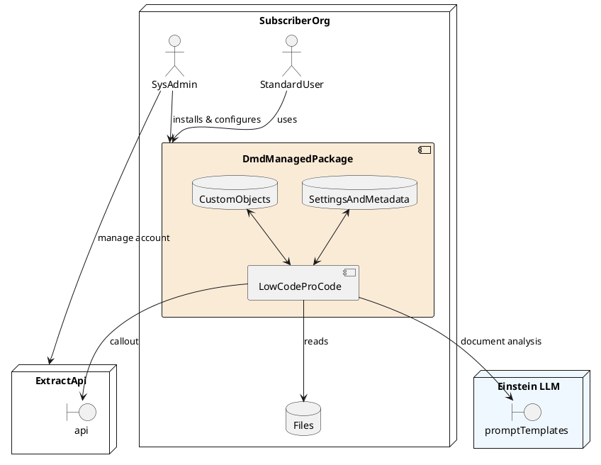
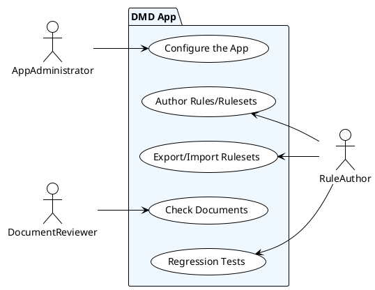
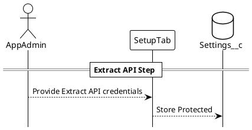
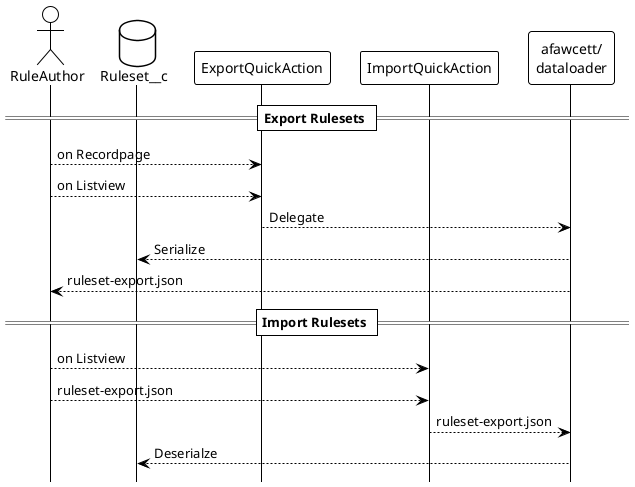
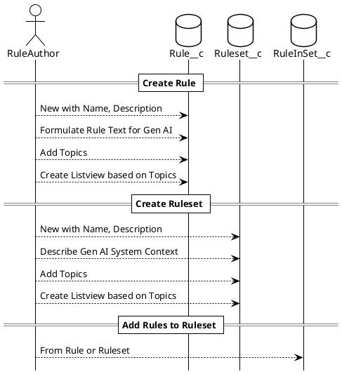
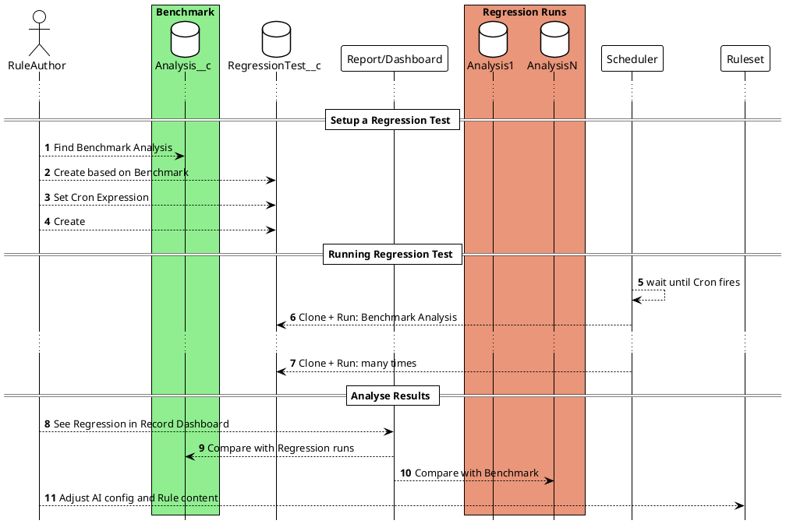
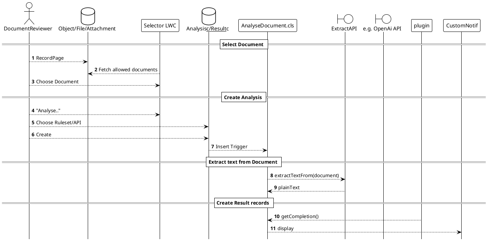
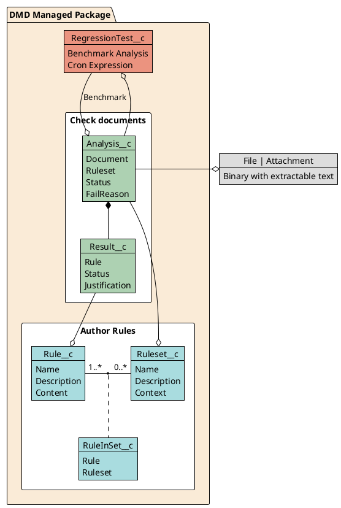

# Solution Design DMD

<!-- TOC tocDepth:2..4 chapterDepth:2..6 -->

- [1. At a glance](#1-at-a-glance)
- [2. Overview](#2-overview)
- [3. Roles, Use Cases and their Implemenentation](#3-roles-use-cases-and-their-implemenentation)
    - [3.1. AppAdministrator](#31-appadministrator)
        - [3.1.1. Configure the App](#311-configure-the-app)
    - [3.2. RuleAuthor](#32-ruleauthor)
        - [3.2.1. Import/Export Rulesets](#321-importexport-rulesets)
        - [3.2.2. Author Rules and Rulesets](#322-author-rules-and-rulesets)
        - [3.2.2. Run and Analyse Regression Tests](#322-run-and-analyse-regression-tests)
    - [3.3. DocumentReviewer](#33-documentreviewer)
        - [3.3.1. Check a Document](#331-check-a-document)
- [4. Data Model](#4-data-model)
    - [4.1. Custom Settings : `Settings__c`](#41-custom-settings-dmdsettings__c)

<!-- /TOC -->

## 1. At a glance

## 2. Overview

DMD which stands for Document Mess Detector lends its name from PMD, the famous Open Source Static Code Analyser, which helps developers to detect messy and risky code. 

DMD leverages Salesforce's Einstein Prompt Templates to apply the concept to Natural Language Documents in daily business situations. This native approach allows administrators to adjust the AI model used and lets non-technical users modify prompts through Salesforce's trusted platform.

As in PMD, DMD allows Users to create sets of rules and then check documents against it.
For the Rulecheck, the document text and rule definitions are processed using Einstein Prompt Templates which analyze the content and respond with structured feedback. For each rule, the app creates a Result record with a description of the status.

When the App is installed in a Subscriber's org:

1. an Admin can use it to enhance the Record pages of Salesforce objects
1. the App can read Files or Attachments
1. the App calls out to two External Services for Text Extraction (Extractor API) and Text Reasoning (OpenAI API)
1. the App writes into Custom Objects, Settings and Custom Metadata

## 3. Roles, Use Cases and their Implementation

The Salesforce app implementing DMD has 3 User Personas with accompanied Permission Sets with the same name that perform multiple Use Cases.

### 3.1. AppAdministrator

Users with the `AppAdministrator.permissionset` need to be a SysAdmin with rights to work in Salesforce Setup, Deploy Metadata changes and customize Salesforce.

#### 3.1.1. Configure the App

As detailed in the User Guide a Sysadmin must install the App from the AppExchange and confirm that the app can use 2 external Endpoints for API communication.

He customizes the app by assigning the installed permission sets to users and adjusting Flexipages of packaged Custom but also Standard objects like Accounts and Opportunities.

Post install the Admin needs to configure the app from Apps Setup tab.

One Setup Step asks for Extract API credentials which on Save are securely stored in a Protected Custom Setting called `Settings__c`. This is used to callout to an external API to extract text from PDF documents in Salesforce.

##### 3.1.1.1. Relevant Packaged Components

- Custom Objects: `Settings__c`
- Tab: `Setup__c.tab-meta.xml`
- Visualforce: `setup.page`, `setupStep.component`
- Classes: `setup/app-setup/*`, `SetupPageCtrl.cls`, `SetupExtractApi(_Test).cls`

##### 3.1.1.2. Security Remarks

- All Authentication credentials are safely stored in Protected Settings or Metadata
- External Endpoints are approved during Package installation

### 3.2. RuleAuthor

Users with the `RuleAuthor.permissionset` can be Standard users. The Permset provides the right CRUD and FLS permissions to perform tasks of managing Rules and Rulesets.

#### 3.2.1. Import/Export Rulesets

For easy exchange of Rules and Rulesets DMD has a Custom Export and Import tool
that uses Andy Fawcetts SObjectdataloader Open Source. It serializes multiple 
`Ruleset__c` objects including related objects like `Rule__c`, `RuleInSet__c` into a single JSON file.

##### 3.2.1.1. Relevant Packaged Components

- Custom Objects/Tabs: `Rule__c`, `Ruleset__c`, `RuleInSet__c`
- LWC: `importRulesets`
- Visualforce: `exportRulesetButton.page`, `exportRulesetsButton.component`
- Classes: `/afawcett/apex-sobjectdataloader/*`, `ExportImportRulesetCtrl(_Test).cls`

##### 3.2.1.2. Security Remarks

- We didn't change the OSS library to prevent PMD or Checkmarx issues but instead added False Positive comments there.
- Only users with the right permission set can see the related pages, call the Controllers and LWC components.
- As Rules are Public Read this works for mostly all Rules and Rulesets in an org.
- Rules and Rulesets of others should not be messed with by others, but reading and cloning them is fine.

#### 3.2.2. Author Rules and Rulesets

Codifying Business requirements into reusable rule, grouping them into document- and
context-specific ruleset is the main task of the Rule author. Using Topics for Objects Rules and Ruleset
can use arbitrary Tags for grouping, versioning and filtering in Listview and Reports.

##### 3.2.2.1. Relevant Packaged Components

- Custom Objects/Tabs: `Rule__c`, `Ruleset__c`, `RuleInSet__c`

##### 3.2.2.2. Security Remarks

1. Rules, Rulesets and their Junction object use PublicRead as Sharing Setting. This allows other people to use and learn from existing rules but not modify them. Rule codify important Company knowledge. So having explicit owners and sharing tables for those who can evolve rules is important.

#### 3.2.2. Run and Analyse Regression Tests

Generative AI is much more powerful but also less reliable for rule checking compared to deterministic methods. The AI Model itsself seems to change over time resulting in Analysis giving results of quality over time. Even if we use a temperature parameter on OpenAI we have seen the same rule to have different results on the same document when called multiple times. 

To monitor such behavior we added a Regression Tester where a given Benchmark Analysis can be repeated over time (using Scheduled jobs) and then the results can be compared to get Accuracy insights.

##### 3.2.2.1. Relevant Packaged Components

- Custom Objects/Tabs: `RegressionTest__c`
- Code: `RegressionTest.trigger`, `ScheduleRegressionTests.cls`
- Reports/Dashboards: All reports, types and Dashboard in the package
- LWC: `regressionResults`

### 3.3. DocumentReviewer

#### 3.3.1. Check a Document

The main use case of the application is running document scan against selected file. Using a simple component, placed on sObject record page, reviewer can start scanning process. When the process is finished, users are informed about this fact via Custom Notifications.

##### 3.3.1.1. Relevant Packaged Components

- Custom Objects/Tabs: `Analysis__c`, `Result__c`
- Settings: `Settings__c`
- LWC: `documentSelector`, `documentAnalysisHistory`
- Classes: `AnalyseDocument(_Test).cls`, `NotifyUserOnAnalysisChange(_Test).cls`, `ExtractApi(_Test).cls`

##### 3.3.1.2. Security Remarks

1. Analysis record have a restrictive Private OWD Sharing model as otherwise their Result child objects could expose confidential information from the analysied documents. The Result's Justification field often explains by quoting the original document why a Rule failed or passed.

1. PDF Documents owned by the current user are sent to the Extract API endpoint authenticated by the `AppAdministrator` after installation

1. Extracted Text plus Rule Content is sent to the Open AI API during Analysis. The OpenAI API is authenticated by the `AppAdministrator` after installation. 

1. For both Endpoints the Package contains `Remote Site Settings` that need to be approved on package install.

1. Errors and Exception that happen during Callouts are caught and persisted including Details into the Analysis__c.FailReason__c and Status__c fields.

## 4. Data Model

The App brings a broad range of Custom Objects for Application data. It doesn't rely on any data in Salesforce Standard Objecs and only works on Files and Attachments.

It also comes with a Protected Custom Setting and a Public Custom Metadata Type with Protected Packaged records.

### 4.1. Custom Settings : `Settings__c`

For safely storing global Application settings the app comes with a Protected Custom Setting. 
Currently we only store API credentials for the Extract API there. This is managed by the custom Setup page.
